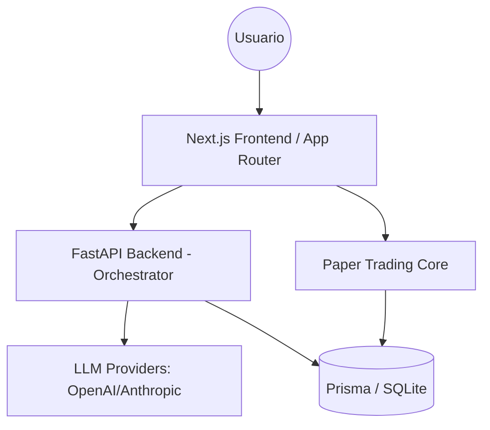

# Arquitectura del Sistema - Agentic Fintech Advisor

## Diagrama de Arquitectura

## Componentes Principales

1.  **Frontend (Next.js 14)**: Gestiona la UI 'Premium Fintech', gráficas de TradingView y el Playground de agentes.
2.  **Orchestrator (FastAPI/LangGraph)**: El cerebro que encadena los agentes. Recibe el output de un analista técnico y lo pasa al analista de sentimiento.
3.  **Paper Trading Engine**: Lógica pura en TypeScript/Python para simular el mercado sin riesgo real.
4.  **Capa de Persistencia**: Prisma actúa como ORM para gestionar el historial de operaciones y las trazas de razonamiento de los agentes.
